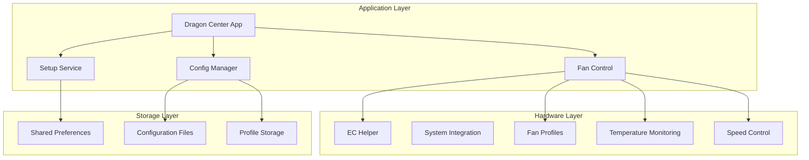
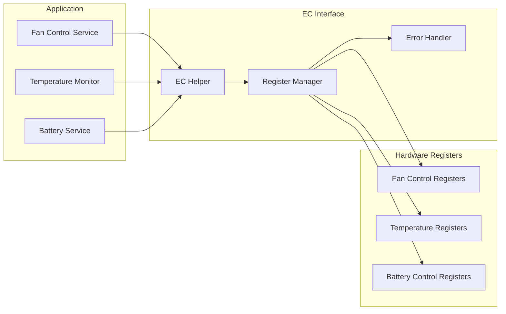
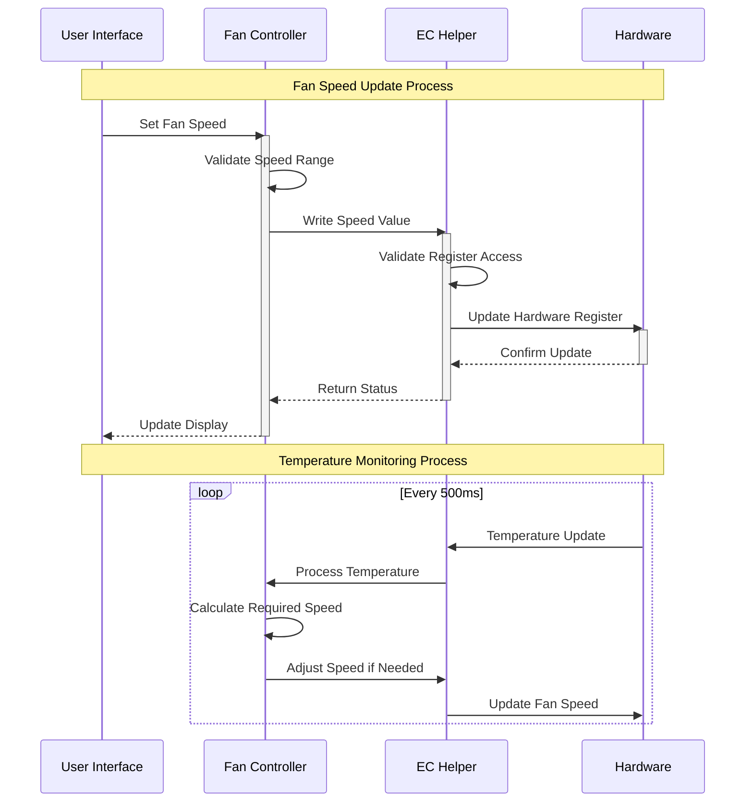

# MSI Dragon Center For Linux

<div align="center">


A modern Flutter application for controlling MSI laptop features with a beautiful, intuitive interface.

[](https://flutter.dev)
[](https://dart.dev)
[](LICENSE)

</div>

## 📑 Table of Contents
- [Features](#-features)
- [Technical Architecture](#-technical-architecture)
  - [Core Components](#core-components)
  - [EC Communication](#ec-communication-architecture)
  - [Fan Control System](#fan-control-system)
- [Technical Implementation](#-technical-implementation)
  - [Fan Control](#fan-control-implementation)
  - [Configuration Management](#configuration-management)
  - [Key Features](#key-technical-features)
- [Prerequisites](#-prerequisites)
- [Installation](#-installation)
- [Configuration](#-configuration)
- [Project Structure](#-project-structure)
- [Contributing](#-contributing)
- [License](#-license)
- [Acknowledgments](#-acknowledgments)

## 🌟 Features

### 🎮 Fan Control
- Customizable fan speed profiles
- Auto and Advanced speed modes
- CPU generation-specific optimizations
- Real-time fan speed monitoring
- Temperature-based fan curve control
- Multiple fan zones support (CPU, GPU)

### ⚙️ System Configuration
- Universal and Custom profile support
- Persistent configuration storage
- Automatic hardware detection
- Profile switching capabilities

### 🎨 Modern UI/UX
- Responsive design
- Intuitive controls
- Real-time monitoring dashboard

## 🛠️ Technical Architecture

### Core Components



### EC Communication Architecture



### Fan Control System



## 🔧 Technical Implementation

### Fan Control Implementation

#### Speed Control
- PWM-based control (0-100 range)
- RPM monitoring (0-5000 RPM)
- Temperature-based adjustment
- Profile-based management
- Emergency shutdown at critical temperatures

#### Temperature Monitoring
- Real-time sensor reading (500ms intervals)
- Temperature thresholds:
  - Warning: 60°C
  - Critical: 80°C
- Historical tracking
- Alert system
- Automatic fan speed adjustment

#### Profile Management
- Dynamic profile switching
- Custom curve support
- Hardware-specific presets
- Profile validation
- Backup/restore functionality

### Configuration Management


### Key Technical Features

#### Hardware Communication
- Direct EC register access
- Low-level hardware control
- Real-time monitoring
- Error handling and recovery
- Hardware state validation

#### Profile Management
- JSON-based configuration
- Version control
- Profile validation
- Migration support
- Backup/restore functionality

#### Performance Optimization
- Efficient state management
- Minimal hardware access
- Caching mechanisms
- Background processing
- Resource management

## 📋 Prerequisites

### Flutter Development Environment
- Flutter SDK (>=3.0.0)
- Dart SDK (>=3.0.0)
- Linux development tools:
  ```bash
  sudo apt update
  sudo apt install build-essential cmake ninja-build pkg-config libgtk-3-dev liblzma-dev
  ```

### System Requirements
- Linux system with MSI laptop
- Required system permissions for EC access
- D-Bus system service
- System tray support
- Hardware-specific drivers
- ACPI EC Driver ([acpi_ec](https://github.com/agnath18K/acpi_ec))


## 🚀 Installation

### 1. Install ACPI EC Driver

First, install the required ACPI EC driver:

```bash
# Clone the acpi_ec repository
git clone https://github.com/agnath18K/acpi_ec.git
cd acpi_ec

# Install build dependencies
sudo apt update
sudo apt install build-essential linux-headers-$(uname -r)

# Install the driver
sudo ./install.sh

# Add your user to the ec group (required for EC access)
sudo usermod -a -G ec $USER
```

**Note:** You'll need to log out and back in for the group changes to take effect.

### 2. Install Dragon Center

1. Clone the repository:
```bash
git clone https://github.com/agnath18K/dragon_center_linux.git
cd dragon_center_linux
```

2. Install dependencies:
```bash
flutter pub get
```

3. Build the application:
```bash
flutter build linux
```

4. Install the package:
```bash
sudo dpkg -i build/linux/x64/deb/dragon_center_linux_1.0.0+1_amd64.deb
```

### Troubleshooting

If you encounter any issues with EC access:

1. Verify the acpi_ec driver is loaded:
```bash
lsmod | grep acpi_ec
```

2. Check driver status:
```bash
dmesg | grep acpi_ec
```

3. Verify device file permissions:
```bash
ls -l /dev/ec*
```

4. Check your group membership:
```bash
groups
```

## 🔧 Configuration

### Profile Types

#### Universal Profile
- Pre-configured settings
- Hardware-specific optimizations
- Automatic temperature management
- Balanced performance settings
- Power efficiency focus

#### Custom Profile
- User-defined fan curves
- Temperature thresholds
- Performance presets
- Power management settings
- Custom monitoring options

### Advanced Settings

#### Fan Control
- Custom fan curves
- Temperature thresholds
- Response time settings
- Minimum/maximum speeds
- Zone-specific control

#### Performance
- CPU power limits
- GPU power management
- Thermal throttling
- Power state control
- Performance modes

## 🏗️ Project Structure

```
lib/
├── core/
│   ├── presentation/    # UI components
│   │   ├── pages/      # Application pages
│   │   ├── widgets/    # Reusable widgets
│   │   └── themes/     # UI themes
│   ├── services/       # Business logic
│   │   ├── setup/      # Setup services
│   │   ├── fan/        # Fan control
│   │   └── system/     # System integration
│   └── utils/          # Helper functions
│       ├── ec/         # EC communication
│       ├── config/     # Configuration
│       └── logging/    # Logging system
├── models/             # Data models
│   ├── fan/           # Fan-related models
│   ├── system/        # System models
│   └── config/        # Configuration models
├── shared/            # Shared components
│   ├── widgets/       # Common widgets
│   ├── constants/     # Constants
│   └── types/         # Type definitions
└── main.dart          # Application entry point
```

## 🤝 Contributing

Contributions are welcome! Please feel free to submit a Pull Request.

1. Fork the repository
2. Create your feature branch (`git checkout -b feature/AmazingFeature`)
3. Commit your changes (`git commit -m 'Add some AmazingFeature'`)
4. Push to the branch (`git push origin feature/AmazingFeature`)
5. Open a Pull Request

### Development Guidelines

- Follow Flutter's style guide
- Add tests for new features
- Update documentation
- Maintain backward compatibility
- Handle errors gracefully

## 📝 License

This project is licensed under the MIT License - see the [LICENSE](LICENSE) file for details.

## 🙏 Acknowledgments

- MSI for their laptop hardware
- Flutter team for the amazing framework
- All contributors who have helped shape this project
- Open-source community for inspiration and tools

---

<div align="center">
Made with ❤️ for MSI laptop users
</div>
